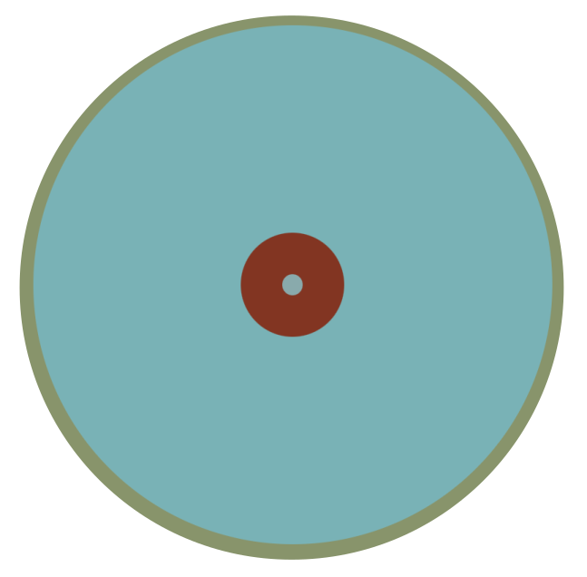
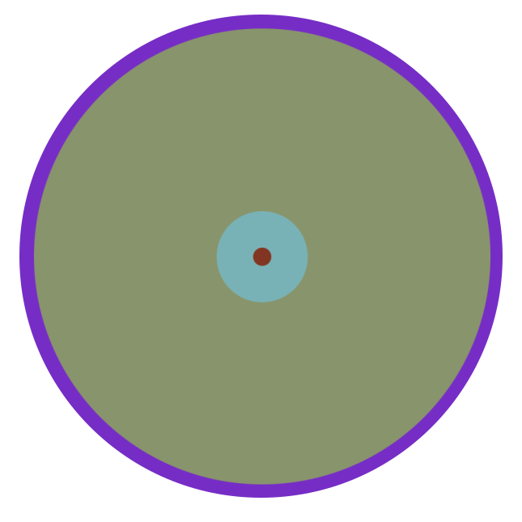
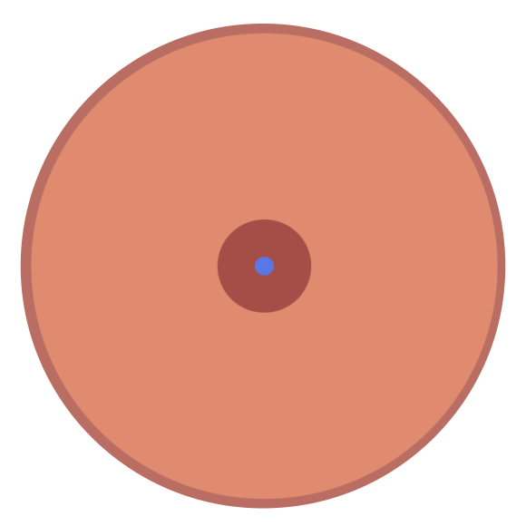
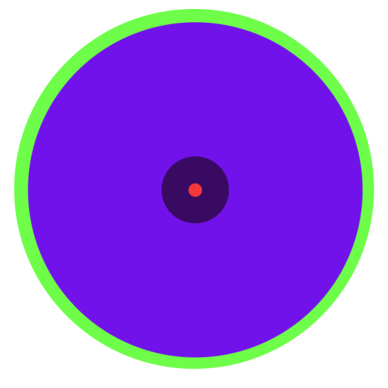

  &nbsp;&nbsp;
  &nbsp;&nbsp;
  &nbsp;&nbsp;
  &nbsp;&nbsp;
  &nbsp;&nbsp;
  

 
 

  &nbsp;
  &nbsp;
  &nbsp;
  &nbsp;
  &nbsp;
  &nbsp;
  &nbsp;
  &nbsp;
  &nbsp;
  &nbsp;
  &nbsp;
  &nbsp;
  &nbsp;
  &nbsp;
  &nbsp;
  &nbsp;
  &nbsp;
  &nbsp;

  &nbsp;
  &nbsp;
  &nbsp;
  &nbsp;
  &nbsp;
  &nbsp;
  &nbsp;
  &nbsp;
  &nbsp;
  &nbsp;
  &nbsp;
  &nbsp;
  

